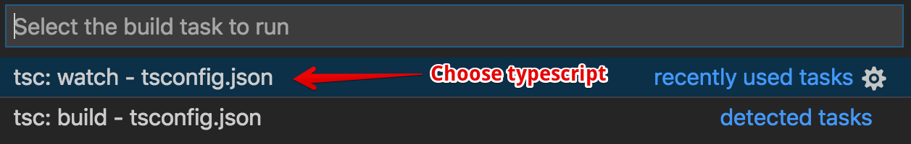
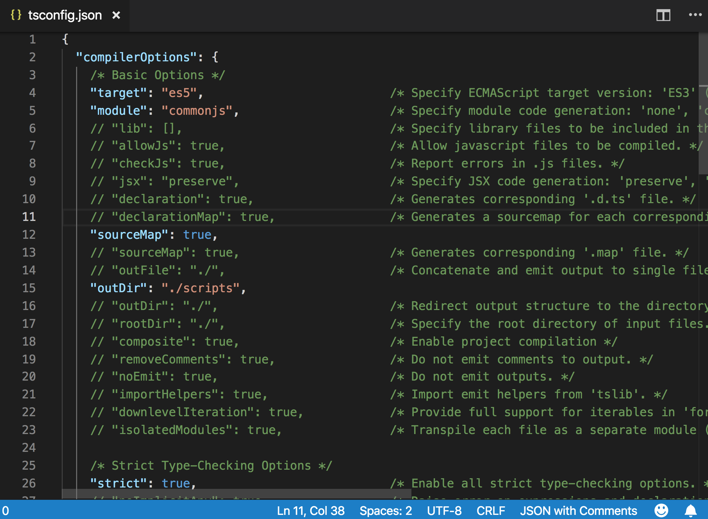
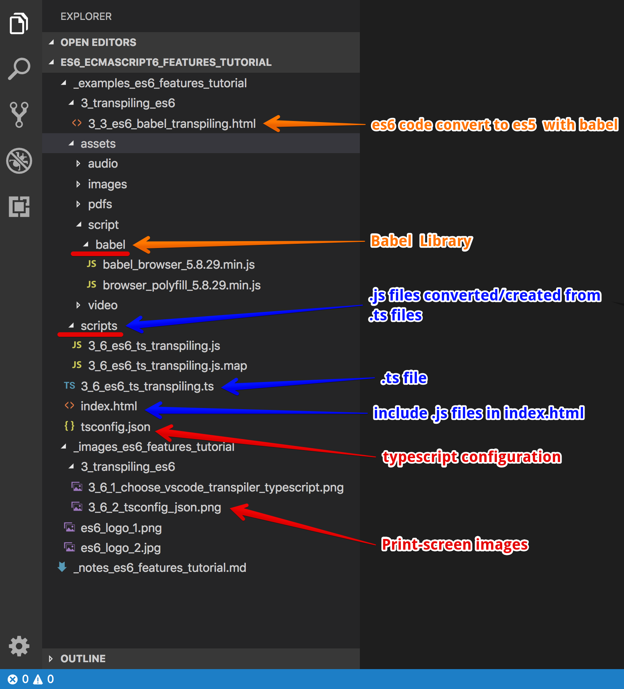
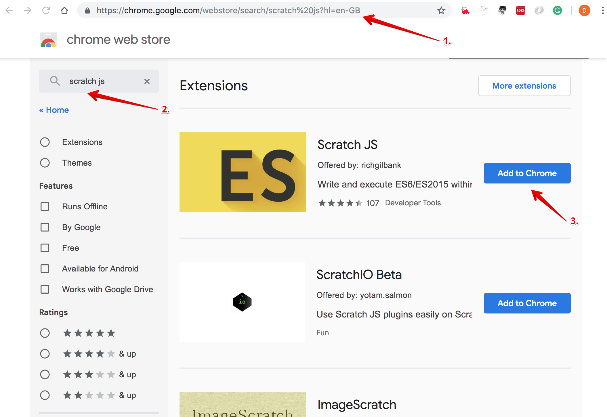
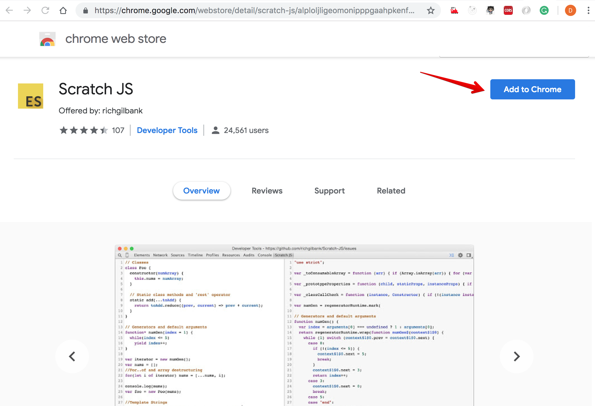
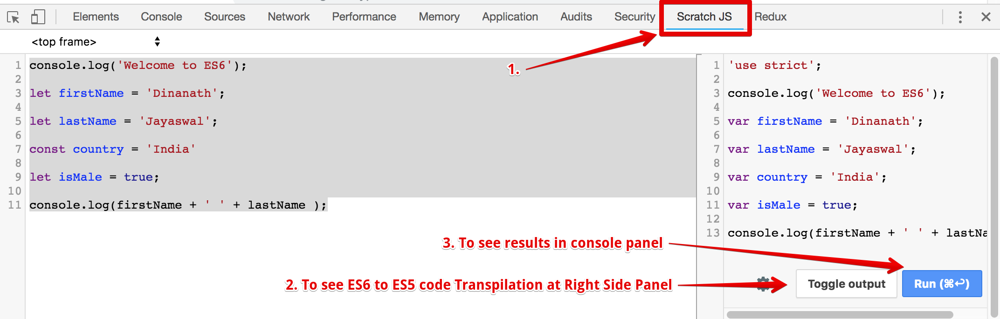

<p align="center">
    
</p>

JavaScript ES6-ECMAScript 6-ECMAScript 2015 Features for everyone
=====================
`ES6-ECMAScript 6-ECMAScript 2015` is the latest version of the specification for JavaScript. Here will meet the `future of JavaScript`: as JavaScript follows ECMAScript standards. This course takes a look at the latest features of ECMAScript 6 (aka ES6) and how these changes are making JavaScript even more powerful and concise. Will learn/review the `new keywords-let const` and `function/object syntax` and shows how the new `class, module syntax` can be used with JavaScript library like Angular, React, Node. You'll also review the ES6 compiling tool `Typescript`,`Babel` and `Scratch JS` and also use these to make your ES6 code compatible with modern browsers.

Prerequisites for current course / What you need to know
=====================
`ES6-ECMAScript 6-ECMAScript 2015` introduces us to the newest language features that can be used in JavaScript code. Due to this, I assume you have some working knowledge/understanding of JavaScript. If you haven't, will recommend watching [JavaScript Essentials Tutorial for beginners](https://github.com/dinanathsj29/javascript-beginners-tutorial). Also, some basic knowledge of HyperText Markup Language (HTML) [HTML5 Essentials](https://github.com/dinanathsj29/html5-essentials-tutorial) and [CSS3 Fundamentals](https://github.com/dinanathsj29/css3-fundamentals-tutorial) will likely be useful in your work with ES6. Finally, you will be using a bit of Angular.js, React.js, and Node.js but nothing that requires deep/advanced knowledge.

Topics include
===================== 
1. [Course Introduction](#section-1-course-introduction)
2. [Introduction to ES6-ECMAScript 6](#section-2-introduction-to-es6-ecmascript-6)
3. [Transpiling ES6-ECMAScript 6](#section-3-transpiling-es6-ecmascript-6)
4. [New Variables—Creation Updating and Scoping](#section-4-new-variables-creation-updating-and-scoping)
5. [Function Improvements objects](#section-5-function-improvements-objects)
6. [Extended Parameter Handling](#section-6-extended-parameter-handling)
7. [Enhancing object literals](#section-7-enhancing-object-literals)
8. [Template Strings Literals](#section-8-template-strings-literals)
9. [Destructuring Assignment](#section-9-destructuring-assignment)
10. [Loops](#section-10-loops)
11. [Classes](#section-11-classes)
12. [Modules](#section-12-modules)
13. [Generators](#section-13-generators)
14. [Sets and WeakSets](#section-14-sets-and-weaksets)
15. [Map and Weak Map](#section-15-map-and-weak-map)
16. [Symbols](#section-16-symbols)
17. [Iterables and Iterators](#section-17-iterables-and-iterators)
18. [String methods](#section-18-string-methods)
19. [Reference](#section-19-reference)
20. [Whats Next Step?](#section-20-whats-next-step)

Section 1. Course Introduction
=====================
1.1. Welcome
---------------------
Hi All, I'm **`Dinanath Jayaswal, Senior UI/Web Developer and Adobe Certified Expert Professional`**, I wanna welcome you to `ES6-ECMAScript 6-ECMAScript 2015`. In this course/tutorial will go over how to start with using the latest ES6 features right with the bang. Will dive into the specifics of ES6 and new features it includes. We'll look at new keywords, syntax, and operators that can be used to simplify code structure. At the end we'll take a look at class, module syntax in ES6 and how that can be used immediately with very popular JavaScript library/frameworks like Angular, React, Node, etc. Let us explore and learn some pretty exciting stuff so let's go ahead and get started with `ES6-ECMAScript 6-ECMAScript 2015`.

`ES6-ECMAScript 6-ECMAScript 2015` will introduce us to the newest language features that can be used in JavaScript code - The Modern JavaScript.

1.2. Who is this for?
---------------------
This course is for anyone and everyone, Almost everyone! who is interested in boost skills and further career - by learning new latest programming/coding standards/features/syntaxes/keywords introduced in the latest version of JavaScript to become a hi-tech developer.

Section 2. Introduction to ES6-ECMAScript 6
=====================
2.1. ES5/ECMAScript 5
---------------------
- JavaScript is standard implementations of standard specifications called ECMAScript
- The last ECMAScript Version is 5.0 ie. ES5
- JavaScript = Language in practice, ES5/ES6 = Langauge standards

2.2. What is ES6-ECMAScript 6-ECMAScript 2015
---------------------
- `1995` - JavaScript invented/created by `“Brandan Eich”` at `Netscape` originally named as `"LiveScript"`
- `1996` - `Microsoft` has developed new version of JavaScript named as `"JScript"` for `IE-3`
- Due to different standards/version on a different browser, there was an urgent need to standardized language
- `ECMA (European Computer Manufacturers Association)` is the governing body which provides standardization/specification or JavaScript language implementation 
- `1997` - ECMAScript 1 released (JavaScript Submitted to `ECMAScript`)
- `2009` - ECMAScript 5 released (`for...each, array method, map, filter`)
- `2015` - ECMAScript 6 released (tones of advanced awesome features - `let, const, function default parameters, arrow function, classes, template string, new array/object methods`)
  - ES6-ECMAScript 6-ECMAScript 2015 is the evolution of ES5...Future of JavaScript
  - ES6 adds a tremendous amount of features to JavaScript such as let, constants, classes, Fat Arrow functions, etc.
  - `ES6-ECMAScript 6-ECMAScript 2015 = ES5 + New Awesome Features`

2.3. Typescript
---------------------
- Typescript is Open source/free development language
- Developed and maintained by Microsoft
- Typed superset of JavaScript which Compiles to plain JavaScript
- It consists of variables Data Types string, number, boolean, etc. but it is optional
- One can write safer/meaningful/easily maintainable/scalable code

2.4. ES6 Browser Support
---------------------
Most of the features will discuss here are supported in `latest version of the major web browsers` such as Google Chrome, Mozilla Firefox, Microsoft Edge, Safari, etc.

Check current browser support and compatibility status for ES6:
- [ES6/ECMAScript 6 compatibility table](https://kangax.github.io/compat-table/es6/)
- [W3C Browser Support for ES6/ECMAScript 6 (ECMAScript 2015)](https://www.w3schools.com/js/js_versions.asp)

> **Note**: Internet Explorer does not support ES6/ECMAScript 6.

2.5. Using ES6/ECMAScript 6 now
---------------------
- If the browser does not support all of the ES6/ECMAScript 6 features than alternatively:
  - we can use the `online transpilers (source-to-source compilers)` free of cost which `transpile our current ES6 code to ES5` for better browser compatibility without leaving out the benefits of enhanced syntax and capabilities of ES6
- Transpiling is the process of taking `ES6 code and converting it into ES5`, so browsers can read it 
- The transpiling process is also used for languages like `CoffeeScript and TypeScript` to convert code into JavaScript
- There are many different transpilers/transpiling tools available, the most popular are: 
  - [Typescript](https://www.typescriptlang.org/)
  - [Babel](https://babeljs.io/), 
  - [Traceur](https://github.com/google/traceur-compiler) and 
  - [Closure](https://closure-compiler.appspot.com/)
- Some testing we can try in [Chrome Canary - https://www.google.com/intl/en_in/chrome/canary/ ](https://www.google.com/intl/en_in/chrome/canary/) a version of Google Chrome (some ES6 feature supported not all, unstable)

Section 3. Transpiling ES6-ECMAScript 6
=====================
3.1 Transpiler
---------------------
- All browsers `does not supports all latest new features` of ES6/ES2015
- Chrome and Firefox supports almost 90% of features
- `Transpilers` - converts ES6/ES2015 code into ES5 (plain JavaScript, browser understandable code)
- Popular Transpilers - Typescript, Babel, Traceur, Closure

3.2. Babel.js (https://babeljs.io/) - working with Babel
---------------------
- Babel is one of the most popular tools for transpiling ES6 code and gets ES5 code 
- Babel was `created by Sebastian McKenzie` an Australian developer at Facebook
- `ReactJS the UI library created by Facebook uses Babel` as a preferred tool for transpiling the ES6 features back into ES5 JavaScript

3.3. Babel in-browser transpiling
---------------------
- In real project it's advisable `not to use In Browser Transformer`, it will force the browser to convert all of the ES6 to ES5 at run time, which may make our projects run much slower
- For the purpose of demo create a .html file and under script tag use an ES6 function syntax to pass default parameters or any other ES6 feature. If browser support ES6 feature you will get proper output else will get error `UnCaught SyntaxError: Unexpected token = `
- To get rid of ES6 non/not support error in browser, download and use/include Babel transpiler script library like: `<script src="babel.js URL">` and finally register/make it official with `<script type="text/babel">`

> **Note**: Now a days majority of browser supports most of the ES6 features so accordingly as per needs/requirements include Babel or other transpilers in HTML file.

> **Syntax & Example**:
```html
<!DOCTYPE html>
<html lang="en">

  <head>

    <!-- include babel library to transpile/convert ES6 code to ES5 -->
    <script src="../assets/script/babel/babel_browser_5.8.29.min.js"></script>
    
    <!-- internal JavaScript - head section -->
    <script type="text/babel">
      // Write all JavaScript code here

      // ES6 function syntax with default parameter
      function showFullName(firstName='Dinanath', lastName='Jayaswal') {
        console.log(firstName + ' '+ lastName);
      }
      showFullName();
    </script>    

  </head>
  
  <body>

  </body>

</html>
```

3.4. Transpiling ES6 with babel and babel node
---------------------
Alternatively, install babel with nodejs ie npm package and use respective commands at CLI to transpile ES6 files into ES5.

3.5. Transpiling ES6 with Webpack
---------------------
- https://webpack.github.io/
- https://webpack.js.org/
- For the larger scale applications its advisable to use a build tool like `webpack` which helps to automate the process like transpiling, less/sass conversion, script/image/CSS bundling and more
- Webpack is a module bundler (bundle your assets, scripts, images, styles)
- Webpack takes modules with dependencies and emits static assets representing those modules
- Create a package.json file (contains module/dependency, documentation, project information) with the command: `npm init`
- Install webpack with node/npm with the command: `npm install -g webpack`
- Install babel-loader (helps to convert ES6 to ES5) node/npm with command: `npm install --save-dev babel-loader`
- Create a `webpack.config.js`
- Run command: `webpack`
- In the .html file with script src use a path of newly created `bundle.js` file

3.6. Typescript - Working and Transpiling with Typescript
---------------------
- Download and Install node (node comes with npm) (website: https://nodejs.org/en)
- After installation check version of node and npm by command: `node -v / npm -v`
- Install a `Text Editor` to write code like `VS code`, `Sublime Text`, `Adobe Brackets` or any one of your choice
- Install a `transpiler` like `typescript` globally to transpile/convert code into plain JavaScript, by using the command: `npm install typescript -g`
- In VS Code editor configure typescript: Press `CTRL+SHIFT+B` -> Choose Task Runner - > Typescript Watch Mode -> it will create `task.json`

<p>
  <figure>
    &nbsp;&nbsp;&nbsp; 
    <figcaption>&nbsp;&nbsp;&nbsp; Image - VScode - Select Typescript as Transpiler</figcaption>
  </figure>
</p>

> **Syntax & Example**: `task.json`
```json
{
  // See https://go.microsoft.com/fwlink/?LinkId=733558 
  // for the documentation about the tasks.json format
  "version": "2.0.0",
  "tasks": [
    {
      "type": "typescript",
      "tsconfig": "tsconfig.json",
      "option": "watch",
      "problemMatcher": [
        "$tsc-watch"
      ]
    },
    {
      "type": "typescript",
      "tsconfig": "tsconfig.json",
      "problemMatcher": [
        "$tsc"
      ]
    }
  ]
}
```

- Create a typescript configuration (`tsconfig.json` file) by using the command: `tsc --init`
  - include/modify some settings in tsconfig.json: 
    - `"sourceMap": true,` - map files helps to debug (.ts to .js mapping)
    - `"outDir": "./scripts",` - typescript transpiler will generate/organize all .js files into scripts folder

> **Syntax & Example**: `tsconfig.json`
```json
{
  "compilerOptions": {
    /* Basic Options */
    "target": "es5",
    "module": "commonjs",
    "outDir": "./scripts",
    "strict": true,
    "esModuleInterop": true
  }
}
```

<p>
  <figure>
    &nbsp;&nbsp;&nbsp; 
    <figcaption>&nbsp;&nbsp;&nbsp; Image - tsconfig.json</figcaption>
  </figure>
</p>

- create a simple .ts file to verify its conversion/transpilation to .js

> **Syntax & Example**: `Typescript 3_6_es6_ts_transpiling.ts`
```typescript
// by default typescript consider all files in a folder as a module, so variables defined in one file will be checked on the fly and throws an error: Cannot redeclare block-scoped variable - to solve issue use export {}

// export {};

console.log('Welcome to ES6');
let firstName: string = 'Dinanath';
let lastName: string = 'Jayaswal';
const country: string = 'India'
let isMale: boolean = true;
console.log(firstName + ' ' + lastName);

// ES6 function syntax with default parameter
function showFullName(_firstName = 'Dinanath', _lastName = 'Jayaswal') {
  console.log(_firstName + ' ' + _lastName);
}
showFullName();
```

- check typescript version by command: `tsc -v`
- check typescript help by command: `tsc -h` or `tsc --help`
- To convert/transpile individual .ts into .js file run command: `tsc fileName.ts`
- Run command for watch mode: `tsc filename.ts --watch` or to watch all files at once type command: `tsc --watch`

> **Syntax & Example**: `Typescript code converted to JavaScript 3_6_es6_ts_transpiling.js`
```javascript
"use strict";
// by default typescript consi: stringder all files in a folder as a module, so variables defined in one file will be checked on the fly and throws error: Cannot redeclare block-scoped variable - to solve issue use export {}
// export {};
console.log('Welcome to ES6');
var firstName = 'Dinanath';
var lastName = 'Jayaswal';
var country = 'India';
var isMale = true;
console.log(firstName + ' ' + lastName);
// ES6 function syntax with default parameter
function showFullName(_firstName, _lastName) {
    if (_firstName === void 0) { _firstName = 'Dinanath'; }
    if (_lastName === void 0) { _lastName = 'Jayaswal'; }
    console.log(_firstName + ' ' + _lastName);
}
showFullName();
//# sourceMappingURL=3_6_es6_ts_transpiling.js.map
```

- create an `index.html` file and include newly created .js file with script tag to check and verify the output

> **Syntax & Example**: index.html
```html
<!DOCTYPE html>
<html lang="en">

  <head>

    <meta charset="UTF-8">
    <meta http-equiv="X-UA-Compatible" content="ie=edge">
    <meta name="viewport" content="width=device-width, initial-scale=1">

     <!-- internal style -->
     <style>
      /* css selector: { property:value; } */
      body {
        font-family: arial;
      }
    </style>

    <title>3_6_es6_ts_transpiling</title>

    <script src="./scripts/3_6_es6_ts_transpiling.js"></script>
   
  </head>

  <body>
      
    <h1>Working with ES6 & Typescript features</h1>

  </body>

</html>
```

- To Run a to run the app from virtual local web server install npm utilities like `serve, HTTP, lite-server, static` etc 
  - command: `npm install lite-server -g`
  - start server with the command: `lite-server` and check the output in the browser

<p>
  <figure>
    &nbsp;&nbsp;&nbsp; 
    <figcaption>&nbsp;&nbsp;&nbsp; Image - App-project folder structure</figcaption>
  </figure>
</p>

3.7. ScratchJS - ES6 to ES5 code transpile/conversion
---------------------
- Typescript installation/transpilation process is pretty lengthy and tedious
- Alternatively, Simply we can add/install a `Google Chrome Extention` named `Scratch JS`, an add-on for DevTools which integrates both the Traceur and Babel transpilers, allowing us to test out the new JS features coming with ES6/ES2015
- `Scratch JS` also supports `CoffeeScript`, `LiveScript` and more compile-to-JS languages will be added soon
- To install `Scratch JS` as a `Google Chrome Extention`:
  - In google chrome web store https://chrome.google.com/webstore/category/extensions?hl=en-GB or at https://www.google.com/ search for Scratch JS
  - From searched result select Scratch JS and click -> ADD to Chrome
    
<p>
  <figure>
    &nbsp;&nbsp;&nbsp; 
    <figcaption>&nbsp;&nbsp;&nbsp; Image - Chrome web store search scratchjs</figcaption>
  </figure>
</p>

<hr/>

<p>
  <figure>
    &nbsp;&nbsp;&nbsp; 
    <figcaption>&nbsp;&nbsp;&nbsp; Image - Google search scratchjs</figcaption>
  </figure>
</p>

- Once extension installed properly, open developer tool (F12, Fn12, Right Click on web page Inspect), click on ScratchJS - at left side type ES6 code and right side check ES5 output

<p>
  <figure>
    &nbsp;&nbsp;&nbsp; 
    <figcaption>&nbsp;&nbsp;&nbsp; Image - Scratchjs ES6 to ES5 code conversion</figcaption>
  </figure>
</p>

Section 4. New Variables Creation Updating and Scoping
=====================
4.1. Purpose/challenges in ES5 (Why ES6)
---------------------
- `Hoisting` - Behind the scene JavaScript declare variables at the top
- `Functional scope` - `var` keyword got functional scope (accessible through-out the function body), at the same time var keyword variables also get hoisted
- `Let keyword block scope` - let keyword variables exist only inside `block { }`scope, but never hoisted

> **Syntax & Example**: `Typescript 4_1_es6_ts_var_hoisting.ts`
```typescript
// by default typescript consider all files in a folder as a module, so variables defined in one file will be checked on the fly and throws an error: Cannot redeclare block-scoped variable - to solve issue use export {}

// export {};

greetUser1('Dinanath1'); //hoising funciton declaration will move to top

function greetUser1(userName1: string) {
    if (userName1 === 'Dinanath1') {
        var greetings1 = 'Hello Dinanath, Welcome';
    } else {
        var greetings1 = 'Hello Guest';
    }
    console.log(greetings1); //var variables available outside as it have functional scope
    var greetings1: string; //hoisting variable declaration will move to top
}

greetUser1('Dinanath2'); 
```

<hr />

> **Syntax & Example**: `JavaScript 4_1_es6_ts_var_hoisting.js`
```javascript
"use strict";
// by default typescript consider all files in a folder as a module, so variables defined in one file will be checked on the fly and throws error: Cannot redeclare block-scoped variable - to solve issue use export {}
// export {};
greetUser1('Dinanath1');//hoising funciton declaration will move to top
function greetUser1(userName1) {
    if (userName1 === 'Dinanath1') {
        var greetings1 = 'Hello Dinanath, Welcome';
    }
    else {
        var greetings1 = 'Hello Guest';
    }
    console.log(greetings1); //var variables available outside as it have functional scope
    var greetings1; //hoisting variable declaration will move to top
}
greetUser1('Dinanath2'); 
//# sourceMappingURL=4_1_es6_ts_var_hoisting.js.map
```

4.2. let keyword
---------------------
- To `deal with scope` in JavaScript we have new keyword named `let` used to declare variables
- We use the let keyword to `create block scoping` in JavaScript in locations where we weren't able to do so before 
- `Let keyword block scope` - let keyword variables exist only inside `block { }`scope
- let keyword variables cannot be used before declaration (`never hoisted`)
- let keyword variables `cannot be re-declared`

> **Syntax & Example**: `Typescript 4_2_es6_ts_let.ts`
```typescript
// by default typescript consider all files in a folder as a module, so variables defined in one file will be checked on the fly and throws an error: Cannot redeclare block-scoped variable - to solve issue use export {}

// export {};

function greetUser1(userName1: string) {
    if (userName1 === 'Dinanath1') {
        var greetings1 = 'Hello Dinanath, Welcome';
    } else {
        var greetings1 = 'Hello Guest';
    }
    console.log(greetings1); //var variables available outside as it have functional scope
    var greetings1: string; //hoisting variable declaration will move to top
}

greetUser1('Dinanath1');

// ------------------------------

/*
function greetUser2(userName2:string){
    if(userName2 === 'Dinanath2'){
        let greetings2 = 'Hello Dinanath2';
    }else{
        let greetings2 = 'Hello Guest';
    }
    console.log(greetings2); //error - let variables not available out side block
}
*/

function greetUser2(userName2: string) {
    let greetings2
    if (userName2 === 'Dinanath2') {
        greetings2 = 'Hello Dinanath2';
    } else {
        greetings2 = 'Hello Guest';
    }
    console.log(greetings2);
}

greetUser2('Dinanath2');

// ------------------------------ 

var num1: number = 10;
var num2: number = 20;

if (num1 === 10) {
    var num1: number = 100;
    let num2: number = 200;
    console.log('inside num1  : ' + num1);
    console.log('inside num2  : ' + num2);
}

console.log('outside num1  : ' + num1);
console.log('outside num2  : ' + num2);

// ------------------------------

// let variables not hoisted
/* function greetUser3(userName3:string){
    if(userName3 === 'Dinanath3'){
        greetings3 = 'Hello Dinanath3'; //error - let variables not hoisted
    }else{
        greetings3 = 'Hello Guest'; //error - let variables not hoisted
    }
    console.log(greetings3); //error - let variables not hoisted
    let greetings3;
} */

// ------------------------------

// let variables not be re-declared

// var firstName: string = 'Dinanath'; //error
// var firstName: string = 'DJ'; //error

let fName;
// let fName; //cannot redeclare block-scoped variable 'fName'
```

<hr />

> **Syntax & Example**: `JavaScript 4_2_es6_ts_let.js`
```javascript
"use strict";
// by default typescript consider all files in a folder as a module, so variables defined in one file will be checked on the fly and throws error: Cannot redeclare block-scoped variable - to solve issue use export {}
// export {};
function greetUser1(userName1) {
    if (userName1 === 'Dinanath1') {
        var greetings1 = 'Hello Dinanath, Welcome';
    }
    else {
        var greetings1 = 'Hello Guest';
    }
    console.log(greetings1); //var variables available outside as it have functional scope
    var greetings1; //hoisting variable declaration will move to top
}
greetUser1('Dinanath1');
// ------------------------------
/*
function greetUser2(userName2:string){
    if(userName2 === 'Dinanath2'){
        let greetings2 = 'Hello Dinanath2';
    }else{
        let greetings2 = 'Hello Guest';
    }
    console.log(greetings2); //error - let variables not available out side block
}
*/
function greetUser2(userName2) {
    var greetings2;
    if (userName2 === 'Dinanath2') {
        greetings2 = 'Hello Dinanath2';
    }
    else {
        greetings2 = 'Hello Guest';
    }
    console.log(greetings2);
}
greetUser2('Dinanath2');
// ------------------------------ 
var num1 = 10;
var num2 = 20;
if (num1 === 10) {
    var num1 = 100;
    var num2_1 = 200;
    console.log('inside num1  : ' + num1);
    console.log('inside num2  : ' + num2_1);
}
console.log('outside num1  : ' + num1);
console.log('outside num2  : ' + num2);
// ------------------------------
// let variables not hoisted
/* function greetUser3(userName3:string){
    if(userName3 === 'Dinanath3'){
        greetings3 = 'Hello Dinanath3'; //error - let variables not hoisted
    }else{
        greetings3 = 'Hello Guest'; //error - let variables not hoisted
    }
    console.log(greetings3); //error - let variables not hoisted
    let greetings3;
} */
// ------------------------------
// let variables not be re-declared
// var firstName: string = 'Dinanath'; //error
// var firstName: string = 'DJ'; //error
var fName;
// let fName; //cannot redeclare block-scoped variable 'fName'
//# sourceMappingURL=4_2_es6_ts_let.js.map
```

4.3. let in for loop
---------------------
- While dealing with `closures and loops` its advisable to `use let` instead of `var`

> **Syntax & Example**: `Typescript 4_3_es6_ts_let_loop.ts`
```typescript
// export {};

for (var i = 1; i <= 5; i++) {
    setTimeout(() => {
        console.log('var based for loop', i); //6
    }, 1000);
}

// ------------------------------

for (let j = 1; j <= 5; j++) {
    setTimeout(() => {
        console.log('let based for loop', j); //1,2,3,4,5
    }, 1000);
}
```

<hr />

> **Syntax & Example**: `JavaScript 4_3_es6_ts_let_loop.js`
```javascript
"use strict";
// export {};
for (var i = 1; i <= 5; i++) {
    setTimeout(function () {
        console.log('var based for loop', i); //6
    }, 1000);
}
var _loop_1 = function (j) {
    setTimeout(function () {
        console.log('let based for loop', j); //1,2,3,4,5
    }, 1000);
};
// ------------------------------
for (var j = 1; j <= 5; j++) {
    _loop_1(j);
}
//# sourceMappingURL=4_3_es6_ts_let_loop.js.map
```

4.4. const keyword (also known as `"immutable variables"`),
---------------------
- Like the let keyword, we can also use `const` an alternative for declaring variables
- const is short for `constant` allows us to set constant variables which `shouldn't be reassigned`
- We can not change the value of const variable, so use const to define `fixed set of values` also to `protect the values` of certain variables
- Creating/Using an existing const variable again or re-assigning value to const variable generates `TypeError, SyntaxError`
- const keyword is used to define/create `variable with read-only` constants
- const must have some value `while declaration/initialized`
- const value is fixed, `not to change/re-assigned` in future
- const is also having `block scope`
- the const value `never hoisted`
- However, we can still change object properties or array elements

### 4.4.1 const keyword variable

> **Syntax & Example**: `Typescript 4_4_1_ts_const_var.ts`
```typescript
// export {};

let firstName

//const firstName1; //error - const must have some value `while declaration/initialized`
const lastName = 'Jayaswal';
// const lastName //error - const value is fixed, `not to change/re-assigned` in future

console.log(firstName);
console.log(lastName);
```

<hr />

> **Syntax & Example**: `JavaScript 4_4_1_ts_const_var.js`
```javascript
"use strict";
// export {};
var firstName;
//const firstName1; //error - const must have some value `while declaration/initialized`
var lastName = 'Jayaswal';
// const lastName //error - const value is fixed, `not to change/re-assigned` in future
console.log(firstName);
console.log(lastName);
//# sourceMappingURL=4_4_1_ts_const_var.js.map
```

### 4.4.2 const with array

> **Syntax & Example**: `Typescript 4_4_2_ts_const_array.ts`
```typescript
// export {};

const PersonArray = ['Dinanath', 'Jayaswal', 35, 'Male', true];

console.log(PersonArray[0]);

// we can re-assign value
PersonArray[0] = 'Vedika';

console.log(PersonArray[0]);

//error - we cannot re-assign new array
/* PersonArray = {

}*/
```

<hr />

> **Syntax & Example**: `JavaScript 4_4_2_ts_const_array.js`
```javascript
"use strict";
// export {};
var PersonArray = ['Dinanath', 'Jayaswal', 35, 'Male', true];
console.log(PersonArray[0]);
// we can re-assign value
PersonArray[0] = 'Vedika';
console.log(PersonArray[0]);
//error - we cannot re-assign new array
/* PersonArray = {

}*/ 
//# sourceMappingURL=4_4_2_ts_const_array.js.map
```

### 4.4.3 const with object

> **Syntax & Example**: `Typescript 4_4_3_ts_const_object.ts`
```typescript
// export {};

const Person = {
  firstName: 'Dinanath',
  lastName: 'Jayaswal',
  age: 35,
  gender: 'Male',
  isMale: true
}

console.log(Person.firstName);

// we can re-assign value
Person.firstName = 'Vedika';

console.log(Person.firstName);

//error - we cannot re-assign new object
/* Person = {

} */
```

<hr />

> **Syntax & Example**: `JavaScript 4_4_3_ts_const_object.js`
```javascript
"use strict";
// export {};
var Person = {
    firstName: 'Dinanath',
    lastName: 'Jayaswal',
    age: 35,
    gender: 'Male',
    isMale: true
};
console.log(Person.firstName);
// we can re-assign value
Person.firstName = 'Vedika';
console.log(Person.firstName);
//error - we cannot re-assign new object
/* Person = {

} */ 
//# sourceMappingURL=4_4_3_ts_const_object.js.map
```

4.5 let vs const
---------------------
- If variables have `one time assignments (fixed value, not changed in future)` use const
- If value re-assignments/`value updation` requires use `let`
- Const variables need value at the time of definition; `const name='Dinanath';`
- Let variables can be defined/initialized with empty value; `let name;`
- Const variables are `immutable, not changeable ` variables
- Let variables are `mutable, can be changed or re-assigned`


Section 5. Function Improvements-objects
=====================
5.1. Arrow functions (Fat Arrow function)
---------------------
- `Arrow functions` also called `fat arrow functions`, have an abbreviated syntax for working with functions with the equal sign and the greater than symbol
- `fat arrow functions` provide syntactical sugar so that we can shorten old function definition, make it more readable and compact
- Fat Arrow function `provides short/concise syntax/way` of writing functions, uses fewer lines of code
- Fat Arrow function also `simplified behavior of this` keyword in JavaScript

> **Syntax & Example**: `Typescript 5_1_es6_ts_fat_arrow_function.ts`
```typescript
// export {};

//normal function
var getNormalValue = function () {
    return 100;
}
console.log('normal function return', getNormalValue());

// ------------------------------

//arrow function
const getArrowValue1 = () => {
    return 200;
}
console.log('fat arrow function return', getArrowValue1());

// ------------------------------

//arrow function - single line return
var getArrowValue2 = () => 500;
console.log('fat arrow function single line return', getArrowValue2());

// ------------------------------

//arrow function - parameter
var getArrowValue3 = (num: number) => num;
console.log('fat arrow function parameter', getArrowValue3(10));

// ------------------------------

console.log('type of getArrowValue2', typeof getArrowValue2);
```

<hr />

> **Syntax & Example**: `JavaScript 5_1_es6_ts_fat_arrow_function.js`
```javascript
"use strict";
// export {};
//normal function
var getNormalValue = function () {
    return 100;
};
console.log('normal function return', getNormalValue());
// ------------------------------
//arrow function
var getArrowValue1 = function () {
    return 200;
};
console.log('fat arrow function return', getArrowValue1());
// ------------------------------
//arrow function - single line return
var getArrowValue2 = function () { return 500; };
console.log('fat arrow function single line return', getArrowValue2());
// ------------------------------
//arrow function - parameter
var getArrowValue3 = function (num) { return num; };
console.log('fat arrow function parameter', getArrowValue3(10));
// ------------------------------
console.log('type of getArrowValue2', typeof getArrowValue2);
//# sourceMappingURL=5_1_es6_ts_fat_arrow_function.js.map
```

5.2. Fat Arrow functions and `this` scope / lexical `this`
---------------------
- Fat arrow functions can help us deal with the scope of the `this` keyword in our JavaScript code
- In `normal JavaScript function context creates their own scope this`
- Fat arrow function => `does not create own scope` for 'this', but refers to its `parents this`

> **Syntax & Example**: `Typescript 5_2_es6_ts_fat_arrow_function_this_scope.ts`
```typescript
// export {};

var EmployeeObj1 = {
    empId1: 111,
    greetings1: function () {
        console.log('this.empId1 : ' + this.empId1);
    }
}

EmployeeObj1.greetings1(); // empId1: 111,

// ------------------------------

//error - internal function 'this' scope created

/* var EmployeeObj2 = {
    empId2: 222,
    greetings2: function () {
        setTimeout(function () {
            console.log('this.empId2 : ' + this.empId2);
        }, 1000)
    }
}

EmployeeObj2.greetings2(); */

// ------------------------------

//internal function 'this' scope created, work around with 'self'

var EmployeeObj3 = {
    empId3: 333,
    greetings3: function () {
        var self = this;
        setTimeout(function () {
            console.log('self.empId3 : ' + self.empId3);
        }, 1000)
    }
}

EmployeeObj3.greetings3(); // empId3: 333,

// ------------------------------

//best work around with fat arrow function =>

var EmployeeObj4 = {
    empId4: 444,
    greetings4: function () {
        setTimeout(() => {
            console.log('this.empId4 : ' + this.empId4);
        }, 1000)
    }
}

EmployeeObj4.greetings4(); // empId4: 444,
```

<hr />

> **Syntax & Example**: `JavaScript 5_2_es6_ts_fat_arrow_function_this_scope.js`
```javascript
"use strict";
// export {};
var EmployeeObj1 = {
    empId1: 111,
    greetings1: function () {
        console.log('this.empId1 : ' + this.empId1);
    }
};
EmployeeObj1.greetings1(); // empId1: 111,
// ------------------------------
//error - internal function 'this' scope created
/* var EmployeeObj2 = {
    empId2: 222,
    greetings2: function () {
        setTimeout(function () {
            console.log('this.empId2 : ' + this.empId2);
        }, 1000)
    }
}

EmployeeObj2.greetings2(); */
// ------------------------------
//internal function 'this' scope created, work around with 'self'
var EmployeeObj3 = {
    empId3: 333,
    greetings3: function () {
        var self = this;
        setTimeout(function () {
            console.log('self.empId3 : ' + self.empId3);
        }, 1000);
    }
};
EmployeeObj3.greetings3(); // empId3: 333,
// ------------------------------
//best work around with fat arrow function =>
var EmployeeObj4 = {
    empId4: 444,
    greetings4: function () {
        var _this = this;
        setTimeout(function () {
            console.log('this.empId4 : ' + _this.empId4);
        }, 1000);
    }
};
EmployeeObj4.greetings4(); // empId4: 444,
//# sourceMappingURL=5_2_es6_ts_fat_arrow_function_this_scope.js.map
```

Section 6. Extended Parameter Handling
=====================
6.1. Default function parameters
---------------------
- ES6 allows function parameters to have/specify simple and intuitive default values
- It simply means that if no arguments are provided to function call these default parameters values will be used
- In ES6 we can set/enter/assign `default value to Parameters`
- If no value passed in functional call than default values/Parameters taken into consideration
- whille checking `arguments.length`, default value is not considered/counted, `only actual passed arguments counted`

> **Syntax & Example**: `Typescript 6_1_es6_ts_parameters_default_value.ts`
```typescript
// export {};

//normal function call 
/* let showValue1 = function (value1) {
  console.log(value1);
}
showValue1(); //undefined - as no parameters passed 
*/
// ------------------------------

let showValue2 = function (value2 = 20) {
  console.log(value2);
  console.log(arguments.length);
  console.log('// ------------------------------');
}

showValue2(); // 20
showValue2(200); // 200

// ------------------------------

let showValue3 = function (value3 = 20, value4 = value3 + 10) {
  console.log(value3);
  console.log(value4);
  console.log(value3, value4);
  console.log(arguments.length);
  console.log('// ------------------------------');
}

showValue3(); // value3=20, value4=30, value3 20, value4 30, arguments.length 0
console.log('// 1 ------------------------------');

showValue3(200);
console.log('// 2 ------------------------------');

showValue3(200, 300);
console.log('// 3 ------------------------------');
```

<hr />

> **Syntax & Example**: `JavaScript 6_1_es6_ts_parameters_default_value.js`
```javascript
"use strict";
// export {};
//normal function call 
/* let showValue1 = function (value1) {
  console.log(value1);
}
showValue1(); //undefined - as no parameters passed
*/
// ------------------------------
var showValue2 = function (value2) {
    if (value2 === void 0) { value2 = 20; }
    console.log(value2);
    console.log(arguments.length);
    console.log('// ------------------------------');
};
showValue2(); // 20
showValue2(200); // 200
// ------------------------------
var showValue3 = function (value3, value4) {
    if (value3 === void 0) { value3 = 20; }
    if (value4 === void 0) { value4 = value3 + 10; }
    console.log(value3);
    console.log(value4);
    console.log(value3, value4);
    console.log(arguments.length);
    console.log('// ------------------------------');
};
showValue3(); // value3=20, value4=30, value3 20, value4 30, arguments.length 0
console.log('// 1 ------------------------------');
showValue3(200);
console.log('// 2 ------------------------------');
showValue3(200, 300);
console.log('// 3 ------------------------------');
//# sourceMappingURL=6_1_es6_ts_parameters_default_value.js.map
```

6.2. Rest parameter operator
---------------------
- rest parameter represents `indefinite number of arguments` as an array
- `...arrayName - is used to convert the individual item into an array`
- Rest parameters don’t restrict the number of values that you can pass to a function
- The values passed must all be of the same type (`multiple arguments of the same type`)
- A rest parameter is specified by prefixing a named parameter with `rest operator (...) i.e. three dots`
- Rest operator is used as function Parameter/argument

> **Syntax & Example**: `Typescript 6_2_es6_ts_parameters_rest_operator.ts`
```typescript
// export {};

// es5 normal function
let displayColors = function () {
    for (let i in arguments) {
        console.log('arguments color list:', arguments[i]);
    }
}

displayColors('cyan');
console.log('------------------------------');

displayColors('cyan', 'magenta');
console.log('------------------------------');

displayColors('cyan', 'magenta', 'yellow');
console.log('------------------------------');

console.log('// ------------------------------');

// es6 rest operator
let showColors = function (...colorsList) {
    console.log('colorsList rest operator:', colorsList);
    console.log('arguments.length:', arguments.length);
    for (let i in colorsList) {
        console.log('colorsList rest operator array loop:', colorsList[i]);
    }
    console.log('// ');
}

showColors('red');
showColors('red', 'green');
showColors('red', 'green', 'blue');
```

<hr />

> **Syntax & Example**: `JavaScript 6_2_es6_ts_parameters_rest_operator.js`
```javascript
"use strict";
// export {};
// es5 normal function
var displayColors = function () {
    for (var i_1 in arguments) {
        console.log('arguments color list:', arguments[i_1]);
    }
};
displayColors('cyan');
console.log('------------------------------');
displayColors('cyan', 'magenta');
console.log('------------------------------');
displayColors('cyan', 'magenta', 'yellow');
console.log('------------------------------');
console.log('// ------------------------------');
// es6 rest operator
var showColors = function () {
    var colorsList = [];
    for (var _i = 0; _i < arguments.length; _i++) {
        colorsList[_i] = arguments[_i];
    }
    console.log('colorsList rest operator:', colorsList);
    console.log('arguments.length:', arguments.length);
    for (var i_2 in colorsList) {
        console.log('colorsList rest operator array loop:', colorsList[i_2]);
    }
    console.log('// ');
};
showColors('red');
showColors('red', 'green');
showColors('red', 'green', 'blue');
//# sourceMappingURL=6_2_es6_ts_parameters_rest_operator.js.map
```

6.3. Spread operator
---------------------
- Spread Operator is opposite to Rest Operator
- The spread operator with the help of 3 dots (...) can turn elements of an array into arguments of a function call, or into elements of an array literal
- ...arrayName - takes an array and `split/convert an array into individual item/string`
- Rest operator is used to `combine`, Spread operator is to `split`
- Spread Operator is used while function called

> **Syntax & Example**: `Typescript 6_3_es6_ts_spread_operator.ts`
```typescript
// export {};

let colorsList = ['red', 'green', 'blue', 'black'];

let showColors = function (...colors) {
    console.log('spread operator:', colors);
    console.log('arguments.length', arguments.length);
    for (let color in colors) {
        console.log('colorsList:', colors[color]);
    }
}

showColors(...colorsList);
console.log('Elements in the colors List:', ...colorsList);
```

<hr />

> **Syntax & Example**: `JavaScript 6_3_es6_ts_spread_operator.js`
```javascript
"use strict";
// export {};
var colorsList = ['red', 'green', 'blue', 'black'];
var showColors = function () {
    var colors = [];
    for (var _i = 0; _i < arguments.length; _i++) {
        colors[_i] = arguments[_i];
    }
    console.log('spread operator:', colors);
    console.log('arguments.length', arguments.length);
    for (var color in colors) {
        console.log('colorsList:', colors[color]);
    }
};
showColors.apply(void 0, colorsList);
console.log.apply(console, ['Elements in the colors List'].concat(colorsList));
//# sourceMappingURL=6_3_es6_ts_spread_operator.js.map
```
                                                                            
Section 7. Enhancing object literals
=====================
7.1. Property shorthand notation
---------------------
- When property names are similar/equivalent to variable name than ES6 provide shorthand notation for object literals

> **Syntax & Example**: `Typescript 7_1_es6_ts_object_property_shorthand.ts`
```typescript
// export {};

//old plain javascript approach
let firstName = 'angular';
let lastName = 'typescript';

let Technology = {
  //new property : variable
  firstName: firstName,
  lastName: lastName
}

console.log(Technology.firstName);
console.log(Technology.lastName);
console.log('// ------------------------------');

// ------------------------------

//ES6 approach - When property names are similar/equivalent to variable name than ES6 provides a shorthand notation for object literals

let version1 = 7;
let version2 = 3;

let newTechnology = {
  firstName,
  lastName,
  version1,
  version2
}
console.log(newTechnology.firstName);
console.log(newTechnology.lastName);
console.log(newTechnology.version1);
console.log(newTechnology.version2);
console.log('// ------------------------------');
```

<hr />

> **Syntax & Example**: `JavaScript 7_1_es6_ts_object_property_shorthand.js`
```javascript
"use strict";
// export {};
//old plain javascript approach
var firstName = 'angular';
var lastName = 'typescript';
var Technology = {
    //new property : variable
    firstName: firstName,
    lastName: lastName
};
console.log(Technology.firstName);
console.log(Technology.lastName);
console.log('// ------------------------------');
// ------------------------------
//ES6 approach - When property names are similar/equivalent to variable name than ES6 provide shorthand notation for object literals
var version1 = 7;
var version2 = 3;
var newTechnology = {
    firstName: firstName,
    lastName: lastName,
    version1: version1,
    version2: version2
};
console.log(newTechnology.firstName);
console.log(newTechnology.lastName);
console.log(newTechnology.version1);
console.log(newTechnology.version2);
console.log('// ------------------------------');
//# sourceMappingURL=7_1_es6_ts_object_property_shorthand.js.map
```

7.2. Property names with space
---------------------
- In ES6 we can use property names with space like `'first name': dinanath,`
- While referring/logging the property instead of `.DOT` notation use `square brackets ['first name']`

> **Syntax & Example**: `Typescript .ts`
```typescript
//In ES6 we can use property names with space like 'first name' 

let lastName = 'last name';

let Employee = {
  'first name': 'Dinanath',
  [lastName]:'Jayaswal'
}

console.log(Employee['first name']);
console.log(Employee['last name']);
console.log(Employee);
```

<hr />

> **Syntax & Example**: `JavaScript .js`
```javascript
"use strict";
//In ES6 we can use property names with space like 'first name' 
var Employee = {
    'first name': 'Dinanath',
};
console.log(Employee['first name']);
//# sourceMappingURL=7_2_es6_ts_object_property_name.js.map
```

Section 8. Template Strings Literals
=====================
8.1. Template Literals (Template Strings)
---------------------
- ES6 new feature `Strings Template` offers a convenient way to work with string concatenation/interpolation
- Template literals provide an easy and clean way to create multi-line strings and perform string interpolation
- Intuitive expression interpolation for single-line and multi-line strings
- Use `back-tick (grave accent)` character and `{ var name in curly brace }`, no + plus sign required
- The best part of Template Literals (Template Strings) is we can `use 'single' "double" quotes inside`

> **Syntax & Example**: `Typescript 8_1_es6_ts_template_strings_literals_interpolation.ts`
```typescript
// export {};

//old plain javascript approach
let user = 'Dinanath';
let greetMessage1 = 'Welcome' + ' ' + user + ' ' + 'to ES6.';

console.log(greetMessage1);
 
console.log('// ------------------------------');

//ES6 Template Literals (Template Strings) approach
let greetMessage2 = `Welcome ${user} to ES6.`;

console.log(greetMessage2);

console.log('// ------------------------------');
// ------------------------------

//ES6 multi-line string
let greetMessage3 = `ES6 Template Literals (Template Strings):
                    With Template Literals (Template Strings)
                    we can add multiple lines in string concatenation/interpolation
`;

console.log(greetMessage3);
```

<hr />

> **Syntax & Example**: `JavaScript 8_1_es6_ts_template_strings_literals_interpolation.js`
```javascript
"use strict";
// export {};
//old plain javascript approach
var user = 'Dinanath';
var greetMessage1 = 'Welcome' + ' ' + user + ' ' + 'to ES6.';
console.log(greetMessage1);
console.log('// ------------------------------');
//ES6 Template Literals (Template Strings) approach
var greetMessage2 = "Welcome " + user + " to ES6.";
console.log(greetMessage2);
console.log('// ------------------------------');
// ------------------------------
//ES6 multi-line string
var greetMessage3 = "ES6 Template Literals (Template Strings):\n                    With Template Literals (Template Strings)\n                    we can add mutiple lines in string concatenation/interpolation\n";
console.log(greetMessage3);
//# sourceMappingURL=8_1_es6_ts_template_strings_literals_interpolation.js.map
```

Section 9. Destructuring Assignment
=====================
- Destructuring Assignment gives us an easy way to extract data from arrays and objects and assign them to variables
- An expression/ES6 shorter syntax that makes it easy to extract values from arrays, or properties from objects, into distinct variables

9.1. Destructuring Array
---------------------

> **Syntax & Example**: `Typescript 9_1_es6_ts_destructuring_array.ts`
```typescript
// export {};

//old plain javascript approach
let arrEmployee = ['Dinanath', 'Jayaswal', 'Male', 35, true];
console.log(arrEmployee[0]);
console.log(arrEmployee[1]);

console.log('// ------------------------------');

//ES6 Destructuring approach
//assign a meaningful name to each positions value
let [first, second, third, fourth, fifth] = arrEmployee;

let [firstName, lastName, gender, age, isSenior] = arrEmployee;

console.log(first);
console.log(second);

console.log(gender);
console.log(age);

console.log('// ------------------------------');

let [fn, ln, , , senior] = arrEmployee

console.log(fn);
console.log(senior);

// ------------------------------
```

<hr />

> **Syntax & Example**: `JavaScript 9_1_es6_ts_destructuring_array.js`
```javascript
"use strict";
// export {};
//old plain javascript approach
var arrEmployee = ['Dinanath', 'Jayaswal', 'Male', 35, true];
console.log(arrEmployee[0]);
console.log(arrEmployee[1]);
console.log('// ------------------------------');
//ES6 Destructuring approach
//assign a meaningful name to each positions value
var first = arrEmployee[0], second = arrEmployee[1], third = arrEmployee[2], fourth = arrEmployee[3], fifth = arrEmployee[4];
var firstName = arrEmployee[0], lastName = arrEmployee[1], gender = arrEmployee[2], age = arrEmployee[3], isSenior = arrEmployee[4];
console.log(first);
console.log(second);
console.log(gender);
console.log(age);
console.log('// ------------------------------');
var fn = arrEmployee[0], ln = arrEmployee[1], senior = arrEmployee[4];
console.log(fn);
console.log(senior);
// ------------------------------
//# sourceMappingURL=9_1_es6_ts_destructuring_array.js.map
```

9.2. Destructuring Object
---------------------
> **Syntax & Example**: `Typescript 9_2_es6_ts_destructuring_object.ts`
```typescript
// export {};

//old plain javascript approach
let objEmployee = {
  firstName: 'Dinanath',
  lastName: 'Jayaswal',
  gender: 'Male',
  age: 35,
  isSenior: true
}
console.log(objEmployee.firstName);
console.log(objEmployee.lastName);

console.log('// ------------------------------');

//ES6 Destructuring approach
//assign a meaningful name to each property

let { firstName, lastName, gender, age, isSenior } = objEmployee;

console.log(firstName);
console.log(lastName);
console.log(gender);
console.log(age);
console.log(isSenior);

console.log('// ------------------------------');

// ------------------------------
```

<hr />

> **Syntax & Example**: `JavaScript 9_2_es6_ts_destructuring_object.js`
```javascript
"use strict";
// export {};
//old plain javascript approach
var objEmployee = {
    firstName: 'Dinanath',
    lastName: 'Jayaswal',
    gender: 'Male',
    age: 35,
    isSenior: true
};
console.log(objEmployee.firstName);
console.log(objEmployee.lastName);
console.log('// ------------------------------');
//ES6 Destructuring approach
//assign a meaningful name to each property
var firstName = objEmployee.firstName, lastName = objEmployee.lastName, gender = objEmployee.gender, age = objEmployee.age, isSenior = objEmployee.isSenior;
console.log(firstName);
console.log(lastName);
console.log(gender);
console.log(age);
console.log(isSenior);
console.log('// ------------------------------');
// ------------------------------
//# sourceMappingURL=9_2_es6_ts_destructuring_object.js.map
```

Section 10. Loops
=====================
10.1. The for...of Loop
---------------------
- `for...of` statement it is kind of for loop but used to loop over Iterables like array,string
- When for of loop is used with string words, it will split individual letters

> **Syntax & Example**: `Typescript .ts`
```typescript
// export {};

// for...of loop
/*for(element of array/string) {
  // Code to be executed
} */

// Iterating over an array
let arrDays = ["Monday", "TuesDay", "Wednesday", "Thursday", "Friday", "Saturday", "Sunday"];

for (let day of arrDays) {
  console.log(day);
  document.write('<li>' + day + '</li>');
}

console.log('// ------------------------------');

// Iterating over string
let name = 'JavaScript';
for (let letter of name) {
  document.write(letter + ',');
  console.log(letter + ',');
}

console.log('// ------------------------------');
// ------------------------------
```

<hr />

> **Syntax & Example**: `JavaScript .js`
```javascript
"use strict";
// export {};
// for...of loop
/*for(element of array/string) {
  // Code to be executed
} */
// Iterating over an array
var arrDays = ["Monday", "TuesDay", "Wednesday", "Thursday", "Friday", "Saturday", "Sunday"];
for (var _i = 0, arrDays_1 = arrDays; _i < arrDays_1.length; _i++) {
    var day = arrDays_1[_i];
    console.log(day);
    document.write('<li>' + day + '</li>');
}
console.log('// ------------------------------');
// Iterating over string
var name = 'JavaScript';
for (var _a = 0, name_1 = name; _a < name_1.length; _a++) {
    var letter = name_1[_a];
    document.write(letter + ',');
    console.log(letter + ',');
}
console.log('// ------------------------------');
// ------------------------------
//# sourceMappingURL=10_1_es6_ts_loop_for_of.js.map
```

Section 11. Classes
=====================
11.1. Class syntax
---------------------
- ES5 and earlier, classes have never existed in JavaScript, ES6 introduced classes which looks similar to classes in other object-oriented languages, such as Java, PHP, etc.
- In Object Oriented Programming OOPS languages classes have been used for a long time to encourage reusability
- ES6 classes are a `syntactical sugar over the prototype-based` Object Oriented pattern
- Classes are the `blueprint for the creation of an object `
- Classes are `special function but do not hoisted`

> **Syntax & Example**: `Typescript 11_1_es6_ts_class.ts`
```typescript
// export {};

// class can not be hoisted
// let person2 = new Person(); // error - Uncaught TypeError: Person is not a constructor

// console.log('// ------------------------------');

class Person {

  // method
  greetings() {
    console.log('inside Person greetings methods');
  }

}

let person1 = new Person();

console.log('typeof Person:', typeof Person);
console.log(person1.greetings());

// adding a method to a class is same like adding method to protorype object
console.log(person1.greetings === Person.prototype.greetings)

console.log('// ------------------------------');
```

<hr />

> **Syntax & Example**: `JavaScript 11_1_es6_ts_class.js`
```javascript
"use strict";
// export {};
// class can not be hoisted
// let person2 = new Person(); // error - Uncaught TypeError: Person is not a constructor
// console.log('// ------------------------------');
var Person = /** @class */ (function () {
    function Person() {
    }
    // method
    Person.prototype.greetings = function () {
        console.log('inside Person greetings methods');
    };
    return Person;
}());
var person1 = new Person();
console.log('typeof Person:', typeof Person);
console.log(person1.greetings());
// adding a method to a class is same like adding method to protorype object
console.log(person1.greetings === Person.prototype.greetings);
console.log('// ------------------------------');
//# sourceMappingURL=11_1_es6_ts_class.js.map
```

11.2. Class Body and Methods
---------------------
- Class body is the main part with in `{ curly braces }`
- Will learn and cover 3 types of methods:
  1. **Constructor method**: 
      - Constructor method is `used to create and initialize objects`
      - In one class there will be `only one constructor method`
      - Constructor method is heart/initialization point of class `called during object creation`
      - Constructor method is first method to run/invoke/initialize `as soon as class instantiate`
      - Example - `constructor() { }`
  2. **Static method**: 
      - `static` keyword is used to create static methods 
      - Can be called without instantiating the class (`called directly with the help of class name`)
      - Example - `static statiMethodName();  PersonClass.statiMethodName()`
  3. **Prototype method**: 
      - Can be `called with the help of new object name`
      - Example - `person1.methodName()`

> **Syntax & Example**: `Typescript 11_2_es6_ts_class_body_methods.ts`
```typescript
// export {};

// class can not be hoisted
// let person2 = new Person(); // error - Uncaught TypeError: Person is not a constructor

// console.log('// ------------------------------');

class Person {

  // constructor method
  constructor(_name) {
    this.name = _name;
    console.log('constructor Person Name:', this.name);
  }

  // static method 
  static showGreetings() {
    console.log('static method showGreetings() - Hello');
  }

  // prototype method
  showMessage() {
    console.log('prototype method showMessage() - Hello');
  }

}

// new class object
let Person1 = new Person('Dinanath');

// invoke static method 
Person.showGreetings();

// invoke prototype method
Person1.showMessage();

console.log('// ------------------------------');
```

<hr />

> **Syntax & Example**: `JavaScript 11_2_es6_ts_class_body_methods.js`
```javascript
"use strict";
// export {};
// class can not be hoisted
// let person2 = new Person(); // error - Uncaught TypeError: Person is not a constructor
// console.log('// ------------------------------');
var Person = /** @class */ (function () {
    // constructor method
    function Person(_name) {
        this.name = _name;
        console.log('constructor Person Name:', this.name);
    }
    // static method 
    Person.showGreetings = function () {
        console.log('static method showGreetings() - Hello');
    };
    // prototype method
    Person.prototype.showMessage = function () {
        console.log('prototype method showMessage() - Hello');
    };
    return Person;
}());
// new class object
var Person1 = new Person('Dinanath');
// invoke static method 
Person.showGreetings();
// invoke prototype method
Person1.showMessage();
console.log('// ------------------------------');
//# sourceMappingURL=11_2_es6_ts_class_body_methods.js.map
```

11.2. Class Inheritance
---------------------
- one class can `inherit or extends from another parent or super class` and use its properties and methods
- ES6 classes make it easier to create objects, implement inheritance by using the `extends` keyword and reuse the code
- Classes that inherit from other classes are referred to as `derived classes or child classes`
- `super()` keyword refer to the parent or super class constructor which is extended
- `extends` keyword denotes inheritance mechanism

> **Syntax & Example**: `Typescript 11_3_es6_ts_class_inheritance.ts`
```typescript
// export {};

class Car {

  // simple constructor method
  /* constructor() {
    console.log('Car constructor');
  } */

  // parameterized constructor method
  constructor(_name) {
    console.log('Car constructor', _name);
  }

  // prototype method
  getModelNumber() {
    return 101;
  }

}

// console.log('// ------------------------------');

class TataCars extends Car {
  constructor(_name1) {
    super(_name1);
    console.log('TataCars constructor', _name1);
  }

  // prototype method - If same method present in child than it overwrite/override parent method
  /* getModelNumber() {
    return 1001;
  } */

  // to call same method from parent use super keyword
  getModelNumber() {
    return super.getModelNumber();
  }
}

// simple constructor method
// let Nexon = new TataCars();

// parameterized constructor method
let Nexon = new TataCars('Tata Nexon');

// prototype method
console.log('Nexon.getModelNumber:', Nexon.getModelNumber());

```

<hr />

> **Syntax & Example**: `JavaScript 11_3_es6_ts_class_inheritance.js`
```javascript
"use strict";
// export {};
var __extends = (this && this.__extends) || (function () {
    var extendStatics = Object.setPrototypeOf ||
        ({ __proto__: [] } instanceof Array && function (d, b) { d.__proto__ = b; }) ||
        function (d, b) { for (var p in b) if (b.hasOwnProperty(p)) d[p] = b[p]; };
    return function (d, b) {
        extendStatics(d, b);
        function __() { this.constructor = d; }
        d.prototype = b === null ? Object.create(b) : (__.prototype = b.prototype, new __());
    };
})();
var Car = /** @class */ (function () {
    // simple constructor method
    /* constructor() {
      console.log('Car constructor');
    } */
    // parameterized constructor method
    function Car(_name) {
        console.log('Car constructor', _name);
    }
    // prototype method
    Car.prototype.getModelNumber = function () {
        return 101;
    };
    return Car;
}());
// console.log('// ------------------------------');
var TataCars = /** @class */ (function (_super) {
    __extends(TataCars, _super);
    function TataCars(_name1) {
        var _this = _super.call(this, _name1) || this;
        console.log('TataCars constructor', _name1);
        return _this;
    }
    // prototype method - If same method present in child than it overwrite/override parent method
    /* getModelNumber() {
      return 1001;
    } */
    // to call same method from parent use super keyword
    TataCars.prototype.getModelNumber = function () {
        return _super.prototype.getModelNumber.call(this);
    };
    return TataCars;
}(Car));
// simple constructor method
// let Nexon = new TataCars();
// parameterized constructor method
var Nexon = new TataCars('Tata Nexon');
// prototype method
console.log('Nexon.getModelNumber:', Nexon.getModelNumber());
//# sourceMappingURL=11_3_es6_ts_class_inheritance.js.map
```

Section 12. Modules
=====================
- `Module divide section of code/program` (Like in the Book we have different Chapters and Sections, in Store we have different Sections of Items, etc)
- Code/Programm - needs separation of concern
- The module helps developers to easily organize, navigate/find different chunks of code
- We can `Export and Import functions/classes from different Modules`
- There are mainly two types of export:
  1. Named Export
  2. Default Export

12.1. Named Export
---------------------
- ES6 introduces file based module, in which each module is represented by a separate .js file
- We can use the `export or import statement` in a module to `export or import variables, functions, classes or any other entity` to/from other modules or files
- We Exports/Exporting variables and functions so that it can be used in/by other modules
- `Export` keyword makes variables/functions/classes ready to be used in other modules
- `Import` keyword makes variables/functions/classes ready to be used/access in current modules
- `Import` statement is hoisted ie moved to the top of declaration
- Imported variables are `read-only, not changed` but `object properties can be changed`

> Let's create a module i.e. a TypeScript/JavaScript file named `script.ts` and place the following code in it:

> **Syntax & Example**: `Typescript script.ts`
```typescript
// export {};

// define variables/functions to export
let fName = 'Dinanath';
const DOBY = 1980;

function getAge(_curYear) {
  console.log(_curYear - DOBY);
}

// Exporting variables and functions so that it can be used in other modules
// Export keyword makes variables/functions/classes ready to be used in other modules

// export let fName;
export { fName, DOBY, getAge };

// console.log('// ------------------------------');
```

<hr />

> **Syntax & Example**: `JavaScript script.js`
```javascript
"use strict";
// export {};
Object.defineProperty(exports, "__esModule", { value: true });
// define variables/functions to export
var fName = 'Dinanath';
exports.fName = fName;
var DOBY = 1980;
exports.DOBY = DOBY;
function getAge(_curYear) {
    console.log(_curYear - DOBY);
}
exports.getAge = getAge;
// console.log('// ------------------------------');
//# sourceMappingURL=12_1_es6_ts_module_script.js.map
```

<hr /> <hr />

> Now create another TypeScript/JavaScript file named `app.ts` which can import named variables/functions/classes from `main.ts/main.js`:

> **Syntax & Example**: `Typescript app.ts`
```typescript
// export {};

// Import keyword makes variables/functions/classes ready to be used/access in current modules
import { fName, DOBY, getAge } from './12_1_es6_ts_module_script';

console.log(fName);
alert(getAge(2019)); 

// console.log('// ------------------------------');
```

<hr />

> **Syntax & Example**: `JavaScript app.js`
```javascript
"use strict";
// export {};
Object.defineProperty(exports, "__esModule", { value: true });
// Import keyword makes variables/functions/classes ready to be used/access in current modules
var _12_1_es6_ts_module_script_1 = require("./12_1_es6_ts_module_script");
console.log(_12_1_es6_ts_module_script_1.fName);
alert(_12_1_es6_ts_module_script_1.getAge(2019));
// console.log('// ------------------------------');
//# sourceMappingURL=12_1_es6_ts_module_app.js.map
```

> Finally create a HTML file `index.html` and include `app.js` file, notice the script tag with `type="module"` attribute

> **Syntax & Example**: `index.html`
```html
<script src="./scripts/12_modules/12_1_es6_ts_module_app.js"></script> 
 OR
<script src="./scripts/12_modules/12_1_es6_ts_module_app.js" type="module"></script> 
```

12.2. Default Export
---------------------
- Whenever a Module exports a single value or function, we can use `default` keyword
- In the case of `Default Export-Import` while export/import `curly brace` not required
- Also while dealing with `Default Export-Import` variable name match not mandatory in case of import

> **Syntax & Example**: `Typescript 12_2_es6_ts_module_default_export_script.ts`
```typescript
// export {};

let fName = 'Dinanath';
export default fName;
```

<hr />

> **Syntax & Example**: `JavaScript 12_2_es6_ts_module_default_export_script.js`
```javascript
"use strict";
// export {};
Object.defineProperty(exports, "__esModule", { value: true });
var fName = 'Dinanath';
exports.default = fName;
//# sourceMappingURL=12_2_es6_ts_module_default_export_script.js.map
```

<hr /><hr />

> **Syntax & Example**: `Typescript 12_2_es6_ts_module_default_import_app.ts`
```typescript
// export {};

import firstName from './12_2_es6_ts_module_default_export_script';
console.log(firstName);
```

<hr />

> **Syntax & Example**: `JavaScript 12_2_es6_ts_module_default_import_app.js`
```javascript
"use strict";
// export {};
var __importDefault = (this && this.__importDefault) || function (mod) {
    return (mod && mod.__esModule) ? mod : { "default": mod };
};
Object.defineProperty(exports, "__esModule", { value: true });
var _12_2_es6_ts_module_default_export_script_1 = __importDefault(require("./12_2_es6_ts_module_default_export_script"));
console.log(_12_2_es6_ts_module_default_export_script_1.default);
//# sourceMappingURL=12_2_es6_ts_module_default_import_app.js.map
```

Section 13. Generators
=====================
13.1. Generators
---------------------
- ES6/ES2015 Generators are `special types of functions which can run-paused anytime`, run some other logic/code and start again as per logic/program flow
- Generators are a new type of function that allows us to `pause functions in the middle of execution`, to be resumed later
- Generator function can be identified/indicated by `an asterisk symbol` right before the function name or immediately following the function keyword (`function*`)
- Generator Function can be paused by using the new `yield` keyword
- To call/invoke/execute Generator Function call `next()` method
- A generator is a function that returns an iterator
- All iterator objects have a `next()` method that returns a result object
- The result object has two properties: 
  - `value`, which is the next value, and 
  - `done`, which is a boolean, initially false and later true when there are no more values to return with `next()` or no more `yields`
- We need to use babel core polyfill `browser-polyfill.js` to use/execute generators function
- generators are also used with `asynchronous external events or timers/intervals`

> **Syntax & Example**: `Typescript 13_1_es6_ts_function_generators.ts`
```typescript
// export {};

function *playCricket() {
  yield 'Set Field';
  console.log('1. yield Set Field');
  yield 'Bowl';
  console.log('2. yield Bowl');
  yield 'Bat';
  console.log('3. yield Bat');
}

// create a reference to the generator function

let cricket = playCricket(); 
console.log(cricket.next());
console.log(cricket.next());
console.log(cricket.next());
console.log(cricket.next()); // done - true;
```

<hr />

> **Syntax & Example**: `JavaScript 13_1_es6_ts_function_generators.js`
```javascript
"use strict";
// export {};
var __generator = (this && this.__generator) || function (thisArg, body) {
    var _ = { label: 0, sent: function() { if (t[0] & 1) throw t[1]; return t[1]; }, trys: [], ops: [] }, f, y, t, g;
    return g = { next: verb(0), "throw": verb(1), "return": verb(2) }, typeof Symbol === "function" && (g[Symbol.iterator] = function() { return this; }), g;
    function verb(n) { return function (v) { return step([n, v]); }; }
    function step(op) {
        if (f) throw new TypeError("Generator is already executing.");
        while (_) try {
            if (f = 1, y && (t = op[0] & 2 ? y["return"] : op[0] ? y["throw"] || ((t = y["return"]) && t.call(y), 0) : y.next) && !(t = t.call(y, op[1])).done) return t;
            if (y = 0, t) op = [op[0] & 2, t.value];
            switch (op[0]) {
                case 0: case 1: t = op; break;
                case 4: _.label++; return { value: op[1], done: false };
                case 5: _.label++; y = op[1]; op = [0]; continue;
                case 7: op = _.ops.pop(); _.trys.pop(); continue;
                default:
                    if (!(t = _.trys, t = t.length > 0 && t[t.length - 1]) && (op[0] === 6 || op[0] === 2)) { _ = 0; continue; }
                    if (op[0] === 3 && (!t || (op[1] > t[0] && op[1] < t[3]))) { _.label = op[1]; break; }
                    if (op[0] === 6 && _.label < t[1]) { _.label = t[1]; t = op; break; }
                    if (t && _.label < t[2]) { _.label = t[2]; _.ops.push(op); break; }
                    if (t[2]) _.ops.pop();
                    _.trys.pop(); continue;
            }
            op = body.call(thisArg, _);
        } catch (e) { op = [6, e]; y = 0; } finally { f = t = 0; }
        if (op[0] & 5) throw op[1]; return { value: op[0] ? op[1] : void 0, done: true };
    }
};
function playCricket() {
    return __generator(this, function (_a) {
        switch (_a.label) {
            case 0: return [4 /*yield*/, 'Set Field'];
            case 1:
                _a.sent();
                console.log('1. yield Set Field');
                return [4 /*yield*/, 'Bowl'];
            case 2:
                _a.sent();
                console.log('2. yield Bowl');
                return [4 /*yield*/, 'Bat'];
            case 3:
                _a.sent();
                console.log('3. yield Bat');
                return [2 /*return*/];
        }
    });
}
// create a reference to generator function
var cricket = playCricket();
console.log(cricket.next());
console.log(cricket.next());
console.log(cricket.next());
console.log(cricket.next()); // done - true;
//# sourceMappingURL=13_1_es6_ts_function_generators.js.map
```

Section 14. Sets and WeakSets
=====================
- JavaScript only had one type of collection, represented by the `Array` type 
- Due to the lack of other collection options, technique led to custom implementations of sets and maps using non-array objects

14.1. Sets ES5
---------------------
- A Set is a list of values but no duplicates set consists of unique values
- In array we access individual element, in Sets, we check some value is present/exists or not but we do not really access the value

> **Syntax & Example**: `Typescript 14_1_es5_ts_sets.ts`
```typescript
// export {};

let currentSet = Object.create(null);

currentSet.name = true; //1, 0

// checking for existence
if (currentSet.name) {

  // do something
  console.log('name property exists');
  
}
```

<hr />

> **Syntax & Example**: `JavaScript 14_1_es5_ts_sets.js`
```javascript
"use strict";
// export {};
var currentSet = Object.create(null);
currentSet.name = true; //1, 0
// checking for existence
if (currentSet.name) {
    // do something
    console.log('name property exists');
}
//# sourceMappingURL=14_1_es6_ts_sets.js.map
```

14.2. Sets ES6
---------------------
- ES 6 adds a Set type that is an ordered list of values without duplicates
- Sets allow fast access to the data they contain, adding a more efficient manner of tracking discrete values
- Following are important methods/properties used with Sets:
  - `new Set()` - Sets are created using `new Set()` and 
  - `add()` - Items are added to a set by calling the `add()` method, 
  - `size` - To see how many items are in a set by checking the `size` property, 
  - `has()` - To check existence of value use `has()` method 
  - `delete` - To delete value from set use `delete` method

> **Syntax & Example**: `Typescript 14_2_es6_ts_sets.ts`
```typescript
// export {};

// create new set
let currentSet2 = new Set();

// add items in set
currentSet2.add("Item One");
currentSet2.add(2);
currentSet2.add("2");

// check size / / number of items in the set
console.log('currentSet2.size:',currentSet2.size);

// duplicates will ignored not allowed - so size will not change
/* currentSet2.add(2);
currentSet2.add("2");

console.log('currentSet2.size',currentSet2.size); */

console.log('// ------------------------------');

// object property based set with chaining method
let objectBasedSet = new Set(), objKey1 = {}, objKey2 = {};

objectBasedSet.add(objKey1).add(objKey2);

console.log('objectBasedSet.size:',objectBasedSet.size);

console.log('// ------------------------------');

// set with duplicates

let techSet = new Set(['JS', 'jQuery', 'Angular', 'Node', 'React', 'JS', 'jQuery']);
console.log('techSet.size:',techSet.size);

// `has` method is used to check existence.availability of value
console.log('Angular present in set:', techSet.has('Angular'));

// delete 
techSet.delete('JS');
console.log('delete techSet.size:',techSet.size);

console.log('// ------------------------------');
```

<hr />

> **Syntax & Example**: `JavaScript 14_2_es6_ts_sets.js`
```javascript
"use strict";
// export {};
// create new set
var currentSet2 = new Set();
// add items in set
currentSet2.add("Item One");
currentSet2.add(2);
currentSet2.add("2");
// check size / / number of items in the set
console.log('currentSet2.size:', currentSet2.size);
// duplicates will ignored not allowed - so size will not change
/* currentSet2.add(2);
currentSet2.add("2");

console.log('currentSet2.size',currentSet2.size); */
console.log('// ------------------------------');
// object property based set with chaining method
var objectBasedSet = new Set(), objKey1 = {}, objKey2 = {};
objectBasedSet.add(objKey1).add(objKey2);
console.log('objectBasedSet.size:', objectBasedSet.size);
console.log('// ------------------------------');
// set with duplicates
var techSet = new Set(['JS', 'jQuery', 'Angular', 'Node', 'React', 'JS', 'jQuery']);
console.log('techSet.size:', techSet.size);
// `has` method is used to check existence.availability of value
console.log('Angular present in set:', techSet.has('Angular'));
// delete 
techSet.delete('JS');
console.log('delete techSet.size:', techSet.size);
console.log('// ------------------------------');
//# sourceMappingURL=14_2_es6_ts_sets.js.map
```

14.3. WeakSets ES5
---------------------
- The `Set` type we learned last.earlier could alternately be called a `strong set`, because of the way it stores object references
- WeakSets `stores only object references` not primitive values also the object references are weak

> **Syntax & Example**: `Typescript 14_3_es5_ts_weaksets.ts`
```typescript
// export {};

let dummySet = new Set(), idKey = {};

dummySet.add(idKey);
console.log(dummySet.size); // 1

console.log('// ------------------------------');

// eliminate original reference
idKey = null;

console.log(dummySet.size);      // 1

// get the original reference back
idKey = [...dummySet][0];

console.log('// ------------------------------');
```

<hr />

> **Syntax & Example**: `JavaScript 14_3_es5_ts_weaksets.js`
```javascript
"use strict";
// export {};
var dummySet = new Set(), idKey = {};
dummySet.add(idKey);
console.log(dummySet.size); // 1
console.log('// ------------------------------');
// eliminate original reference
idKey = null;
console.log(dummySet.size); // 1
// get the original reference back
idKey = dummySet.slice()[0];
console.log('// ------------------------------');
//# sourceMappingURL=14_3_es5_ts_weaksets.js.map
```

14.4. WeakSets ES6
---------------------
- On the fundamentals of Garbage Collection and to avoid memory leaks `weakSets` are introduces
- The main advantage of WeakSets over Sets is `memory is handled properly`
- Weak sets `do not have a size` property

> **Syntax & Example**: `Typescript 14_4_es6_ts_weaksets.ts`
```typescript
// export {};

let peopleSet = new WeakSet(), nameKey = {};

// add the object to the peopleSet
peopleSet.add(nameKey);

console.log(peopleSet.has(nameKey));      // true

console.log('// ------------------------------');

nameKey = null;

console.log(peopleSet.has(nameKey));      // false

console.log('// ------------------------------');

peopleSet.delete(nameKey);

console.log(peopleSet.has(nameKey));      // false
```

<hr />

> **Syntax & Example**: `JavaScript 14_4_es6_ts_weaksets.js`
```javascript
"use strict";
// export {};
var peopleSet = new WeakSet(), nameKey = {};
// add the object to the peopleSet
peopleSet.add(nameKey);
console.log(peopleSet.has(nameKey)); // true
console.log('// ------------------------------');
nameKey = null;
console.log(peopleSet.has(nameKey)); // false
console.log('// ------------------------------');
peopleSet.delete(nameKey);
console.log(peopleSet.has(nameKey)); // false
//# sourceMappingURL=14_4_es6_ts_weaksets.js.map
```

Section 15. Map and Weak Map
=====================
- A map is nothing more than a collection of key-value pair
- A map is a collection of keys that correspond to specific values
- Each item in a map stores two pieces of data, and values are retrieved by specifying the key to read from
- Maps are frequently used as caches, for storing data to be quickly retrieved later
- The only real difference between an object used as a set and an object used as a map is the value being stored
- In array we access individual element, in Sets we check some value is present/exists or not, in Maps we actually retrieve the value

15.1. Maps ES5
---------------------
> **Syntax & Example**: `Typescript 15_1_es5_ts_maps.ts`
```typescript
// exports{}

let currentMap = Object.create(null);

currentMap.name = "Dinanath";

// retrieving a value
let nameValue = currentMap.name; 
console.log(nameValue);
```

<hr />

> **Syntax & Example**: `JavaScript 15_1_es5_ts_maps.js`
```javascript
"use strict";
// exports{}
var currentMap = Object.create(null);
currentMap.name = "Dinanath";
// retrieving a value
var nameValue = currentMap.name;
console.log(nameValue);
//# sourceMappingURL=15_1_es5_ts_maps.js.map
```

15.2. Maps ES6
---------------------
- The ES6 Map type is an `ordered list of key-value pairs`, where both the key and the value can have any type
- Following are important methods/properties used with Maps:
  - `new Map()` - Maps are created using `new Map()` and 
  - `set()` - Items are added to a map by calling the `set()` method, 
  - `get()` - Items are retrieved by calling the `set()` method, 
  - `size` - To see/know how many key, value pairs  are present in a map
  - `has()` - To check existence of value use `has()` method / to determine given key exists in the map
  - `delete` - To delete key, value from set use `delete` method
  - `clear()` - To removes all keys and values pairs from the map

> **Syntax & Example**: `Typescript 15_2_es6_ts_maps.ts`
```typescript
// exports{}

let bookMap = new Map();
bookMap.set('bookTitle', 'Learn ES6');
bookMap.set('bookYear', 2018);

console.log(bookMap.get('bookTitle'));
console.log(bookMap.get('bookYear'));
console.log('bookMap.size:', bookMap.size);

console.log('// ------------------------------');
// console.log('// ------------------------------');

console.log(bookMap.has('bookTitle'));

bookMap.delete('bookYear');
console.log('bookMap.size:', bookMap.size);

bookMap.clear();
console.log(bookMap.has('bookTitle'));
console.log('bookMap.size:', bookMap.size);

console.log('// ------------------------------');
// console.log('// ------------------------------');

let personDetailsMap = new Map(), nameKey = {}, ageKey = {};

personDetailsMap.set(nameKey, 'Dinanath');
personDetailsMap.set(ageKey, 35);

console.log(personDetailsMap.get(nameKey));
console.log(personDetailsMap.get(ageKey));
console.log('personDetailsMap.size:',personDetailsMap.size);

console.log('// ------------------------------');
// console.log('// ------------------------------');
```

<hr />

> **Syntax & Example**: `JavaScript 15_2_es6_ts_maps.js`
```javascript
"use strict";
// exports{}
var bookMap = new Map();
bookMap.set('bookTitle', 'Learn ES6');
bookMap.set('bookYear', 2018);
console.log(bookMap.get('bookTitle'));
console.log(bookMap.get('bookYear'));
console.log('bookMap.size:', bookMap.size);
console.log('// ------------------------------');
// console.log('// ------------------------------');
console.log(bookMap.has('bookTitle'));
bookMap.delete('bookYear');
console.log('bookMap.size:', bookMap.size);
bookMap.clear();
console.log(bookMap.has('bookTitle'));
console.log('bookMap.size:', bookMap.size);
console.log('// ------------------------------');
// console.log('// ------------------------------');
var personDetailsMap = new Map(), nameKey = {}, ageKey = {};
personDetailsMap.set(nameKey, 'Dinanath');
personDetailsMap.set(ageKey, 35);
console.log(personDetailsMap.get(nameKey));
console.log(personDetailsMap.get(ageKey));
console.log('personDetailsMap.size:', personDetailsMap.size);
console.log('// ------------------------------');
// console.log('// ------------------------------');
//# sourceMappingURL=15_2_es6_ts_maps.js.map
```

15.3. Iterating over Maps 
---------------------
- By using arrays we can set/add key, value pairs to maps during initialization
- `entries()` method is used to retrieve both keys, value pairs at a time

> **Syntax & Example**: Type code in ScratchJS `Typescript 15_3_es6_ts_iterating_over_maps.ts`
```typescript
let placeMap = new Map([
  ['country','Bharat'],
  ['capital','Delhi']
]);

// Iterating only keys with for...of loop 
for (let key of placeMap.keys()){
  console.log('key:',key);
}

console.log('// ------------------------------');
// console.log('// ------------------------------');

// Iterating only values with for...of loop 
for (let value of placeMap.values()){
  console.log('value:',value);
}

console.log('// ------------------------------');
// console.log('// ------------------------------');

// Iterating over key, value both at a time
for (let entry of placeMap.entries()) {
  console.log(`keys: ${entry[0]} <==> values: ${entry[1]}`);
} 

console.log('// ------------------------------');
// console.log('// ------------------------------');

// Iterating over key, value both at a time with destructuring
for (let [key,value] of placeMap.entries()) {
  console.log(`keys: ${key} <==> values: ${value}`);
} 
```

<hr />

> **Syntax & Example**: `JavaScript 15_3_es6_ts_iterating_over_maps.js`
```javascript
'use strict';

var _slicedToArray = function () { function sliceIterator(arr, i) { var _arr = []; var _n = true; var _d = false; var _e = undefined; try { for (var _i = arr[Symbol.iterator](), _s; !(_n = (_s = _i.next()).done); _n = true) { _arr.push(_s.value); if (i && _arr.length === i) break; } } catch (err) { _d = true; _e = err; } finally { try { if (!_n && _i["return"]) _i["return"](); } finally { if (_d) throw _e; } } return _arr; } return function (arr, i) { if (Array.isArray(arr)) { return arr; } else if (Symbol.iterator in Object(arr)) { return sliceIterator(arr, i); } else { throw new TypeError("Invalid attempt to destructure non-iterable instance"); } }; }();

var placeMap = new Map([['country', 'Bharat'], ['capital', 'Delhi']]);

// Iterating only keys with for...of loop
var _iteratorNormalCompletion = true;
var _didIteratorError = false;
var _iteratorError = undefined;

try {
  for (var _iterator = placeMap.keys()[Symbol.iterator](), _step; !(_iteratorNormalCompletion = (_step = _iterator.next()).done); _iteratorNormalCompletion = true) {
    var key = _step.value;

    console.log('key:', key);
  }
} catch (err) {
  _didIteratorError = true;
  _iteratorError = err;
} finally {
  try {
    if (!_iteratorNormalCompletion && _iterator.return) {
      _iterator.return();
    }
  } finally {
    if (_didIteratorError) {
      throw _iteratorError;
    }
  }
}

console.log('// ------------------------------');
// console.log('// ------------------------------');

// Iterating only values with for...of loop
var _iteratorNormalCompletion2 = true;
var _didIteratorError2 = false;
var _iteratorError2 = undefined;

try {
  for (var _iterator2 = placeMap.values()[Symbol.iterator](), _step2; !(_iteratorNormalCompletion2 = (_step2 = _iterator2.next()).done); _iteratorNormalCompletion2 = true) {
    var value = _step2.value;

    console.log('value:', value);
  }
} catch (err) {
  _didIteratorError2 = true;
  _iteratorError2 = err;
} finally {
  try {
    if (!_iteratorNormalCompletion2 && _iterator2.return) {
      _iterator2.return();
    }
  } finally {
    if (_didIteratorError2) {
      throw _iteratorError2;
    }
  }
}

console.log('// ------------------------------');
// console.log('// ------------------------------');

// Iterating over key, value both at a time
var _iteratorNormalCompletion3 = true;
var _didIteratorError3 = false;
var _iteratorError3 = undefined;

try {
  for (var _iterator3 = placeMap.entries()[Symbol.iterator](), _step3; !(_iteratorNormalCompletion3 = (_step3 = _iterator3.next()).done); _iteratorNormalCompletion3 = true) {
    var entry = _step3.value;

    console.log('keys: ' + entry[0] + ' <==> values: ' + entry[1]);
  }
} catch (err) {
  _didIteratorError3 = true;
  _iteratorError3 = err;
} finally {
  try {
    if (!_iteratorNormalCompletion3 && _iterator3.return) {
      _iterator3.return();
    }
  } finally {
    if (_didIteratorError3) {
      throw _iteratorError3;
    }
  }
}

console.log('// ------------------------------');
// console.log('// ------------------------------');

// Iterating over key, value both at a time with destructuring
var _iteratorNormalCompletion4 = true;
var _didIteratorError4 = false;
var _iteratorError4 = undefined;

try {
  for (var _iterator4 = placeMap.entries()[Symbol.iterator](), _step4; !(_iteratorNormalCompletion4 = (_step4 = _iterator4.next()).done); _iteratorNormalCompletion4 = true) {
    var _step4$value = _slicedToArray(_step4.value, 2);

    var _key = _step4$value[0];
    var _value = _step4$value[1];

    console.log('keys: ' + _key + ' <==> values: ' + _value);
  }
} catch (err) {
  _didIteratorError4 = true;
  _iteratorError4 = err;
} finally {
  try {
    if (!_iteratorNormalCompletion4 && _iterator4.return) {
      _iterator4.return();
    }
  } finally {
    if (_didIteratorError4) {
      throw _iteratorError4;
    }
  }
}
```

15.4. WeakMaps ES6
---------------------
- Weak maps are the way to store weak object references, every key must be an object

> **Syntax & Example**: Type code in ScratchJS `Typescript 15_4_es6_ts_weakmaps.ts`
```typescript
let placeMap = new WeakMap()
let objKeys = {};

placeMap.set(objKeys, 'Bharat');
console.log(placeMap.get(objKeys));

objKeys = null;
console.log(placeMap.get(objKeys));
```

<hr />

> **Syntax & Example**: `JavaScript 15_4_es6_ts_weakmaps.js`
```javascript
'use strict';

var placeMap = new WeakMap();
var objKeys = {};

placeMap.set(objKeys, 'Bharat');
console.log(placeMap.get(objKeys));

objKeys = null;
console.log(placeMap.get(objKeys));
```

Section 16. Symbols
=====================
16.1. Symbols Introduction
---------------------
- `Symbol` is a `new primitive data type introduced in ES6/ES2015` to generate `unique ids` but we never get access to such ids
- Because symbols are primitive values, calling `new Symbol()` throws an error

> **Syntax & Example**: `Typescript 16_1_es6_ts_symbol.ts`
```typescript
// exports{}

// let firstSymbol = symbol();
let firstSymbol = Symbol('First Symbol');
console.log('typeof firstSymbol:',typeof firstSymbol);
console.log('firstSymbol.toString:',firstSymbol.toString())

console.log('// ------------------------------');
// console.log('// ------------------------------');

// symbol always create a unique ids
// let symbol1 = Symbol();
// let symbol2 = Symbol();

// console.log(symbol1 === symbol2);

let symbol1 = Symbol('i am symbol1');
let symbol2 = Symbol('i am symbol2');

console.log(symbol1 === symbol2);

console.log('// ------------------------------');
// console.log('// ------------------------------');
```

<hr />

> **Syntax & Example**: `JavaScript 16_1_es6_ts_symbol.js`
```javascript
"use strict";
// exports{}
// let firstSymbol = symbol();
var firstSymbol = Symbol('First Symbol');
console.log('typeof firstSymbol:', typeof firstSymbol);
console.log('firstSymbol.toString:', firstSymbol.toString());
console.log('// ------------------------------');
// console.log('// ------------------------------');
// symbol always create a unique ids
// let symbol1 = Symbol();
// let symbol2 = Symbol();
// console.log(symbol1 === symbol2);
var symbol1 = Symbol('i am symbol1');
var symbol2 = Symbol('i am symbol2');
console.log(symbol1 === symbol2);
console.log('// ------------------------------');
// console.log('// ------------------------------');
//# sourceMappingURL=16_1_es6_ts_symbol.js.map
```

16.2. Symbols Registry
---------------------
- `Symbols Registry` helps to store symbol so that we can use/share it in/with other files
- `Symbol.for()` method is used store symbol in the global symbol registry/library
- once two or more symbols added/stored in symbol registry than they become identical/non-unique
- The `Symbol.for()` method first searches the global symbol registry to see `if a symbol with the key "uid" exists`
- `Symbol.keyFor()` methods retrieve description/key/uid of symbol registry

> **Syntax & Example**: `Typescript 16_2_es6_ts_symbol_registry.ts`
```typescript
// exports{}

let oneSymbol = Symbol.for('SymbolRegistry');
let twoSymbol = Symbol.for('SymbolRegistry');

console.log(oneSymbol === twoSymbol); // true - as uid/keys passed 'SymbolRegistry' is same for both

console.log('key/uid:', Symbol.keyFor(oneSymbol));
console.log('key/uid:', Symbol.keyFor(twoSymbol));

console.log('// ------------------------------');
// console.log('// ------------------------------');

let id = Symbol('uid');
let Employee = {
  [id]: 101,
}

console.log(Object.getOwnPropertyNames(Employee));
console.log(Object.getOwnPropertySymbols(Employee)); // Symbol('uid')
```

<hr />

> **Syntax & Example**: `JavaScript 16_2_es6_ts_symbol_registry.js`
```javascript
"use strict";
// exports{}
var _a;
var oneSymbol = Symbol.for('SymbolRegistry');
var twoSymbol = Symbol.for('SymbolRegistry');
console.log(oneSymbol === twoSymbol); // true - as uid/keys passed 'SymbolRegistry' is same for both
console.log('key/uid:', Symbol.keyFor(oneSymbol));
console.log('key/uid:', Symbol.keyFor(twoSymbol));
console.log('// ------------------------------');
// console.log('// ------------------------------');
var id = Symbol('uid');
var Employee = (_a = {},
    _a[id] = 101,
    _a);
console.log(Object.getOwnPropertyNames(Employee));
console.log(Object.getOwnPropertySymbols(Employee)); // Symbol('uid')
//# sourceMappingURL=16_2_es6_ts_symbol_registry.js.map
```

16.3. Iterating over Symbols
---------------------
- ECMAScript 6 has predefined symbols called `well-known symbols` that represent common behaviors in JavaScript that were previously considered internal-only operations, 
- There are many `built-in symbol` or `well-known symbols` in ES6, Each well-known symbol is represented by a property on the Symbol object, such as `Symbol.create`, `Symbol.match`,`Symbol.replace`,`Symbol.search`,`Symbol.iterator` and so on
- `Symbol.iterator` is one of the built-in symbols, to run ES6 loops like `for...of`, the object must consist of `Symbol.iterator` method
- `String & Array` have `Symbol.iterator` method, `Number & Object` does not have `Symbol.iterator`

> **Syntax & Example**: `Typescript 16_3_es6_ts_symbol_iterator.ts`
```typescript
// exports{}

let string1 = 'Dinanath';
let array1 = ['Dinanath', 29] 
let num1 = 29;
let object1 = {name: 'Dinanath'};

// check Symbol.iterator` method exist on which primitive data type
console.log('string Symbol.iterator:', typeof string1[Symbol.iterator]);
console.log('array Symbol.iterator:', typeof array1[Symbol.iterator]);
console.log('num Symbol.iterator:', typeof num1[Symbol.iterator]);
console.log('object Symbol.iterator:', typeof object1[Symbol.iterator]);
```

<hr />

> **Syntax & Example**: `JavaScript 16_3_es6_ts_symbol_iterator.js`
```javascript
"use strict";
// exports{}
var string1 = 'Dinanath';
var array1 = ['Dinanath', 29];
var num1 = 29;
var object1 = { name: 'Dinanath' };
// check Symbol.iterator` method exist on which primitive data type
console.log('string Symbol.iterator:', typeof string1[Symbol.iterator]);
console.log('array Symbol.iterator:', typeof array1[Symbol.iterator]);
console.log('num Symbol.iterator:', typeof num1[Symbol.iterator]);
console.log('object Symbol.iterator:', typeof object1[Symbol.iterator]);
//# sourceMappingURL=16_3_es6_ts_symbol_iterator.js.map
```

Section 17. Iterables and Iterators
=====================
- ES6 introduced `iteration` - a new way to traverse data makes working with collections of data easier
- `Iterators` are just objects with a specific interface designed for iteration
- All iterator objects have a `next() method that returns a result object`
- The result object has two properties: `value`, which is the next value, and `done`, which is a boolean that’s true when there are no more values to return
- The iterator keeps an internal pointer to a location within a collection of values and with each call to the next() method, it returns the next appropriate value
- `Iterable` - any object that implements a method `Symbol.iterator(), which returns `Iterator`
- `Iterator` - any object that implements a `next()` method, to access elements in collection which returns `IResultObj`
- `IResultObj` - Contains two properties `value` (the next value) and `done` (indicates iteration completed or not)
- `for...of` loop uses Iterator functionality/mechanism with `next()` method to loop through an object

17.1. Iterators
---------------------

> **Syntax & Example**: `Typescript 17_1_es6_ts_iterator.ts`
```typescript
// exports{}

let iterableArray = ['One', 'Two', 'Three', 'Four', 'Five']

function createCustomIterator(_arr) {
  let curCount = 0;
  return {
    next: function () {
      return curCount < iterableArray.length ? { value: iterableArray[curCount++], done: false } : { value: 'iteration completed', done: true };
    }
  }
}

let customIterator1 = createCustomIterator(iterableArray);

console.log(customIterator1.next());
console.log(customIterator1.next());
console.log(customIterator1.next());
console.log(customIterator1.next());
console.log(customIterator1.next());
console.log(customIterator1.next());
console.log(customIterator1.next());

console.log('// ------------------------------');
// console.log('// ------------------------------');
```

<hr />

> **Syntax & Example**: `JavaScript 17_1_es6_ts_iterator.js`
```javascript
"use strict";
// exports{}
var iterableArray = ['One', 'Two', 'Three', 'Four', 'Five'];
function createCustomIterator(_arr) {
    var curCount = 0;
    return {
        next: function () {
            return curCount < iterableArray.length ? { value: iterableArray[curCount++], done: false } : { value: 'iteration completed', done: true };
        }
    };
}
var customIterator1 = createCustomIterator(iterableArray);
console.log(customIterator1.next());
console.log(customIterator1.next());
console.log(customIterator1.next());
console.log(customIterator1.next());
console.log(customIterator1.next());
console.log(customIterator1.next());
console.log(customIterator1.next());
console.log('// ------------------------------');
// console.log('// ------------------------------');
//# sourceMappingURL=17_1_es6_ts_iterator.js.map
```

17.2. Iterating objects
---------------------
- JavaScript `objects are not iterable`
- `for...of` loop doesn't work on objects directly 

> **Syntax & Example**: Type code in ScratchJS `Typescript 17_2_es6_ts_iterating_objects.ts`
```typescript
// exports{}

let HumanObj = {
  name: 'Dinanath',
  age: 35,
  country: 'India'
}

// for...of loop error - Symbol.iterator is not a function
/* for (let info of HumanObj) {
  console.log(info);
} */

HumanObj[Symbol.iterator] = function () {
  let objProperties = Object.keys(HumanObj);
  let curCount = 0;
  let isDone = false;

  let next = () => {
    if (curCount >= objProperties.length) {
      isDone = true;
    }
    return { done: isDone, value: this[objProperties[curCount++]] }
  }
  return { next };
}

// for...of loop with object
for (let info of HumanObj) {
  console.log(info);
}

console.log('// ------------------------------');
// console.log('// ------------------------------');
```

<hr />

> **Syntax & Example**: Type code in ScratchJS `JavaScript 17_2_es6_ts_iterating_objects.js`
```javascript
'use strict';

// exports{}

var HumanObj = {
  name: 'Dinanath',
  age: 35,
  country: 'India'
};

// for...of loop error - Symbol.iterator is not a function
/* for (let info of HumanObj) {
  console.log(info);
} */

HumanObj[Symbol.iterator] = function () {
  var _this = this;

  var objProperties = Object.keys(HumanObj);
  var curCount = 0;
  var isDone = false;

  var next = function next() {
    if (curCount >= objProperties.length) {
      isDone = true;
    }
    return { done: isDone, value: _this[objProperties[curCount++]] };
  };
  return { next: next };
};

// for...of loop with object
var _iteratorNormalCompletion = true;
var _didIteratorError = false;
var _iteratorError = undefined;

try {
  for (var _iterator = HumanObj[Symbol.iterator](), _step; !(_iteratorNormalCompletion = (_step = _iterator.next()).done); _iteratorNormalCompletion = true) {
    var info = _step.value;

    console.log(info);
  }
} catch (err) {
  _didIteratorError = true;
  _iteratorError = err;
} finally {
  try {
    if (!_iteratorNormalCompletion && _iterator.return) {
      _iterator.return();
    }
  } finally {
    if (_didIteratorError) {
      throw _iteratorError;
    }
  }
}

console.log('// ------------------------------');
// console.log('// ------------------------------');
```

Section 18. String methods
=====================
18.1. Repeat
---------------------
- `repeat` is the new ES6 function/method returns new string number of times as passed in the parameter
- `String.prototype.repeat(times);`

> **Syntax & Example**: `Typescript .ts`
```typescript
let strText = 'Dinanath';
console.log(strText.repeat(3));
```

18.2. startsWith
---------------------
- `String.prototype.startsWith(searchString[, position]);`

> **Syntax & Example**: `Typescript .ts`
```typescript
let strText = 'Dinanath';

console.log(strText.startsWith("D"));   // true
console.log(strText.startsWith("i",1)); // true
```

18.3. endsWith
---------------------
- `String.prototype.endsWith(searchString[, position]);`

> **Syntax & Example**: `Typescript .ts`
```typescript
let strText = 'Dinanath';

console.log(strText.endsWith("h"));       // true
console.log(strText.endsWith("Dina",4));  // true
```

18.4. includes
---------------------
- `String.prototype.includes(searchString[, position]);`

> **Syntax & Example**: `Typescript .ts`
```typescript
let strText = 'Dinanath';

console.log(strText.includes("t"));   // true
```

Section 19. Reference
=====================
19.1. Websites / Blogs
---------------------
- http://es6-features.org
- https://www.ecma-international.org/ecma-262/6.0/
- https://babeljs.io/docs/en/learn
- https://www.w3schools.com/js/js_es6.asp

19.2. Books
---------------------
- http://exploringjs.com/es6/
- https://leanpub.com/understandinges6/read/

Section 20. What's Next Step?
=====================
This is superb! Thank you for joining me for `JavaScript ES6-ECMAScript 6-ECMAScript 2015 Features for everyone`. I hope you will start checking/testing and incorporating these features into your code right away. I hope now you have a solid understanding of ES6 new features. Your next step could be looking into [ES7 standards/features](http://kangax.github.io/compat-table/es2016plus/) which is very new and not purely tested, or look into [TypeScript Tutorials](https://github.com/dinanathsj29/typescript-tutorial).
